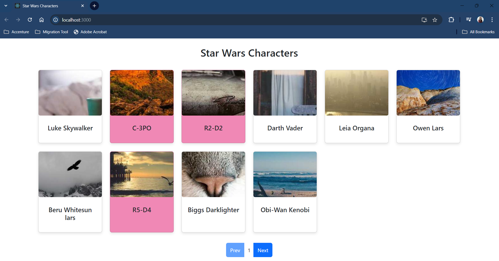
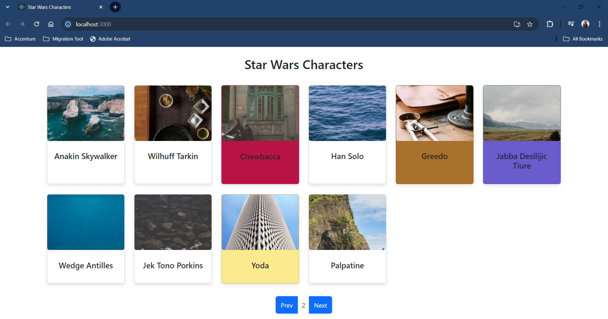
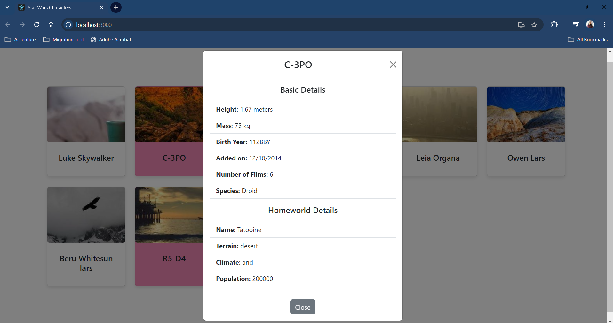

# Star Wars Characters App

## Overview

The Star Wars Characters App is a React application that provides a user interface to explore and view details about Star Wars characters. It integrates with an API to fetch character data and displays it in a clean and interactive format. The app includes features such as character list view, detailed character modals, and error handling.

## Features

- **Character List**: View a list of Star Wars characters.
- **Character Modal**: Get detailed information about a selected character, including homeworld and species.
- **Loading Indicators**: Display loading spinners while fetching data.
- **Error Handling**: Show error messages if data fetching fails.

## Technologies Used

- **React**: Frontend library for building the user interface.
- **TypeScript**: Provides type safety and better tooling.
- **React Bootstrap**: UI component library for styling.
- **Axios**: HTTP client for making API requests.
- **Jest**: Testing framework for unit tests.
- **React Testing Library**: Utility for testing React components.

## Available Scripts

To initialize the project and install all the required dependencies and packages, you can run:

### `npm install`

In the project directory, you can run:

### `npm start`

Runs the app in the development mode.\
Open [http://localhost:3000](http://localhost:3000) to view it in the browser.

The page will reload if you make edits.\
You will also see any lint errors in the console.

### `npm test`

Launches the test runner in the interactive watch mode.

## User Interface

#### Homepage - Page 1

#### Homepage - Page 2

#### Homepage - Page 1

